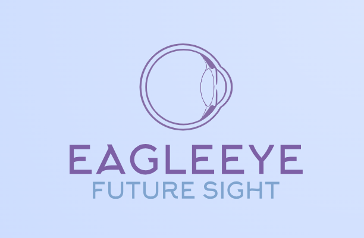

## Pioneering Diabetic Retinopathy Detection

 
 

  <figure>
    
     
    <figcaption>EagleEye: The Future in Diabetic Retinopathy Proactive Treatment</figcaption>
  </figure>

 

### Project Overview

At the forefront of medical diagnostics innovation, EagleEye is pioneering the application of advanced deep learning techniques to revolutionize the early detection of diabetic retinopathy (DR). Our project harnesses the power of the DenseNet-121 model, a cutting-edge convolutional neural network renowned for its exceptional performance in handling complex image data. By leveraging a comprehensive dataset of fundus camera images meticulously labeled for various stages of DR, our model integrates sophisticated preprocessing techniques to enhance image quality and optimize diagnostic accuracy. This groundbreaking initiative is poised to transform the landscape of healthcare delivery, equipping ophthalmologists and healthcare providers with a potent tool in the quest to combat diabetic blindness and improve patient outcomes.

---

### About Us

**EagleEye** is a pioneering healthcare technology company that aims to revolutionize the diagnosis and treatment of diabetic retinopathy with AI-powered image analysis. In the complex landscape of today's healthcare, the company addresses the vital need for accurate, efficient, and swift diagnosis. EagleEye's specialization lies in detecting diabetic retinopathy, and it offers an AI-powered diagnostic system tailored for healthcare professionals. This initiative is particularly significant for ophthalmology, a field often challenged by the timeliness and precision of retinal image interpretation.

**Our Mission and Vision**
EagleEye's mission is to provide a more accurate, efficient, and accessible diagnostic solution for healthcare providers and patients alike. Our vision is to make advanced ophthalmic diagnostics accessible to all healthcare facilities, from major hospitals to local clinics, and to equip healthcare providers worldwide with the tools they need to deliver fast, accurate, and early diagnoses of diabetic retinopathy. We aim to reduce the global burden of vision loss caused by diabetic retinopathy and to improve patient outcomes through timely interventions.

**Our Technology**
Our system integrates cutting-edge machine learning algorithms to provide a detailed analysis of retinal images. By using the DenseNet-121 model, our system enhances feature extraction and utilizes depth to accurately assess and classify the stages of diabetic retinopathy. Our platform empowers patients to take a more active role in their eye health by providing them with personalized information about their diabetic retinopathy risk and severity, enabling them to work more effectively with their healthcare providers to manage their condition.

**Business Strategy**
From a business perspective, EagleEye strategically caters to various sectors, including healthcare, education, and the workplace. Our objectives encompass diagnostic support, telemedicine capabilities, workplace injury prevention, and patient health monitoring. What sets us apart is our commitment to simplicity, model accuracy, and dedicated customer support. We distinguish ourselves from more complex competitors through our adherence to the Blue Ocean Strategy, an approach that prioritizes innovation and differentiation.

**Objectives and Strategies**
To achieve our business goals, we have set the following objectives:

*   Improve Diagnostic Accuracy: Achieve high accuracy in detecting diabetic 
retinopathy and its stages using image analysis powered by AI.
Increase Early Detection Rates: Increase the number of patients diagnosed with diabetic retinopathy at an early stage, enabling timely interventions and preventing vision loss.
*   Reduce Healthcare Costs: Reduce healthcare costs associated with diabetic retinopathy by minimizing the need for invasive treatments and hospitalizations.
*   Enhance Patient Experience: Provide a seamless and user-friendly experience for patients, enabling them to easily access and manage their eye health.
Our strategies for achieving our objectives include integrating our system with Electronic Health Records (EHRs) to enable seamless data exchange and streamline clinical workflows. We also plan to enable remote image analysis and reporting, which will facilitate telemedicine consultations and reduce the need for in-person visits.

